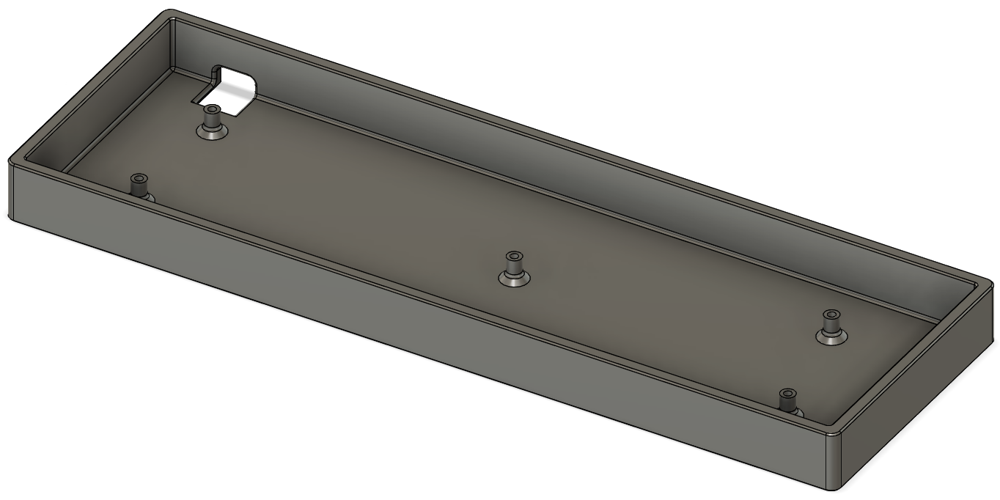

# Atom47 case

In this repository you will only find a 3d printable case for now. The STL file is obviously for use in slicers, but if you wish to make any changes to it you can use the STEP or Fusion archive files. Please read the license before use.

This case should be compatible with the stock Vortex Core assembly as well.

